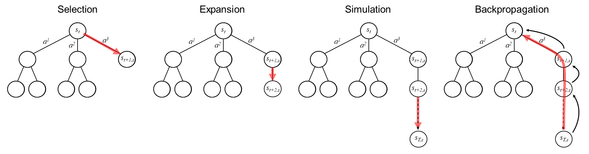

# MCTS_PtG

The **MCTS_PtG** project provides a framework for the economic optimization of Power-to-Gas (PtG) dispatch using Monte Carlo Tree Search (MCTS). PtG is a technology that enables the chemical energy storage of renewable energy in chemical energy carriers such as hydrogen (H<sub>2</sub>) or methane (CH<sub>4</sub>). **MCTS_PtG** implements *decision-time planning* of PtG operation, using process data along with day-ahead electricity, natural gas, and emissions spot market data.  

This repository provides the source code for the MCTS algorithm and a data-driven process model of a real-world PtG plant.


*Figure 1: Utilization of Monte Carlo Tree Search for dispatch optimization of a Power-to-Gas plant.*

---

## Table of Contents

1. [Overview](#overview)
2. [Project structure](#project-structure)
3. [Installation and Usage](#installation-and-usage)
4. [License](#license)
5. [Citing](#citing)
6. [References](#references)

---

## Overview

**MCTS_PtG** is written in Python and includes a data-driven process model of a real-world PtG plant in **PtGEnv** (adapted from [1, 2]). This section This section gives an overview of the application and details the MCTS algorithm used. For more information about **PtGEnv**, please refer to [1, 2].

### Application

The application details are also stated in [2] (https://github.com/SimMarkt/RL_PtG); for the sake of completeness, they are also included here.

The PtG process typically begins with water electrolysis, where an electric current is used to split water (H<sub>2</sub>O) into hydrogen and oxygen (O<sub>2</sub>). **RL_PtG** assumes a proton exchange membrane (PEM) electrolyzer with a load-dependent efficiency modeled after a commercial system [3]. The efficiency has been derived using experimental data and linear regression with nonlinear basis functions [4].  

In addition to PEM electrolysis, **MCTS_PtG** incorporates a chemical methanation unit that converts hydrogen and carbon dioxide (CO<sub>2</sub>) into methane. Since biogas contains a significant amount of CO₂ (up to 55%), this process utilizes biogas as a carbon source. To accurately model the methanation unit's process dynamics—which dominate the overall PtG system dynamics—the approach integrates a time-series process model based on experimental data from a real-world pilot plant.  

The experimental data captures plant behavior during startup, load changes, cooldown, and standby operations of the methanation unit. In standby mode, the reactor temperature is maintained at approximately 190°C to enable a rapid warm startup. The data-driven process model switches between different time-series datasets to simulate dynamic plant operations. This approach is both simple and highly accurate and provides that the plant operates consistently and predictably [1].  

Figure 2 illustrates the current PtG process, where the produced CH<sub>4</sub> can either be injected into the natural gas grid or used in a gas engine for combined heat and power (CHP) generation. The various methods of processing and selling CH<sub>4</sub> define three distinct business scenarios (BS) within this application:  

- **BS1**: Trades CH<sub>4</sub> on the natural gas spot market.  
- **BS2**: Sells CH<sub>4</sub> to a bilateral partner via Over-the-Counter (OTC) contracts.  
- **BS3**: Integrates a CHP plant and sells the generated electrical power (*P<sub>el</sub>*) through special tenders under the German Renewable Energy Act (EEG).  

Additional revenue sources include heat, oxygen, and European Emission Allowances (EUA). Since BS1 and BS2 bind CO₂ in methane, they can generate revenue by selling EUAs through the European Emissions Trading System (EU-ETS). The primary operational costs of the process include electricity and water, with electricity being purchased from the German Day-ahead spot market.  

**MCTS_PtG** integrates historical electricity market data from `data/spot_market_data/`, sourced from SMARD [4]. The original research and RL training in [1] also utilized historical market data for gas and EUA from MONTEL [5]. However, due to licensing restrictions, the present repository only includes synthesized datasets that replicate the statistical properties and non-linear characteristics of the original data.  

The **MCTS_PtG** framework models the complete PtG process, including PEM electrolysis, chemical methanation, and energy market data, within the **PtGEnv** environment (*Gymnasium* framework). For an overview of the project's directories and files, refer to the [Project Structure](#project-structure) section.  


*Figure 2: Optimization framework for Power-to-Gas dispatch using Monte Carlo Tree Search (MCTS) and the PtGEnv environment including the different business cases.*

### MCTS Algorithm

The MCTS algorithm is a rollout-based approach for decision-time planning. In this context, decision-time planning means that computations are performed at the moment a decision is needed, rather than constructing a complete plan in advance [6].

MCTS operates in a loop consisting of four main steps (see Fig. 3), incrementally building a search tree to guide decision-making. The loop runs for a predefined number of iterations:

1. **Selection:**
Starting from the root node, MCTS recursively selects child nodes according to a tree/selection policy until a leaf node is reached.
The tree policy balances exploration (trying less-visited nodes) and exploitation (choosing high-reward nodes).
Typical policies are based on *Upper Confidence Bound for Trees* (UCT).

<pre> ``` aₜ = argmaxₐ [ Q(s, a) / N(s, a) + c * sqrt(ln(N(s)) / N(s, a)) ] ``` </pre>

Q(s,a): Total reward from simulations for this child.
N(s,a): Number of times this child has been visited.
N(s): Number of times the parent node has been visited.
c: Exploration constant.

2. **Expansion:**
If the selected node is not terminal and has untried actions, **MCTS_PtG** expands the tree by creating one or more child nodes for those actions.

3. **Simulation (Rollout):**
From the new node, MCTS performs a rollout and simulates a sequence of actions with the simulator until a terminal state is reached.
In **MCTS_PtG**, the rollout policy is simply following the action of the node, which was discovered as a better choice than a random policy.
Random policies dramatically fail in **PtGEnv** [1].
(Other Rollout policies are in progress)

4. **Backpropagation:**
MCTS propagates the simulation result back up the tree, updating statistics (like visit counts and total reward) for each node along the path.



*Figure 3: The four phases of the Monte Carlo Tree Search algorithm—Selection, Expansion, Simulation, and Backpropagation.*

**Note:** Due to the deterministic nature of the current rollout policy and the memory access bottleneck in **PtGEnv**, **MCTS_PtG** does not implement rollout parallelization or high-performance compilation using JAX or NUMBA.

**Note:** During the Selection and Expansion steps, **MCTS_PtG** uses action masking to ensure only valid actions are considered. These valid actions are defined by the programmable logic controller (PLC) of the real-world PtG plant and depend on its operational state [1]. The following table outlines the possible actions::

| Operation State  | Startup | Partial Load | Full Load | Cooldown | Standby |
|----------------|-----------------|-----------------|-----------------|-----------------|-----------------|
| *a_Startup*   | ✅               | ❌              | ❌              | ✅               | ✅               |
| *a_PartialLoad* |   ❌           | ✅               | ✅               | ❌              | ❌             |
| *a_FullLoad*   |  ❌            | ✅               | ✅               | ❌              | ❌             |
| *a_Cooldown* |  ✅               | ✅               | ✅               | ✅               | ✅               |
| *a_Standby* |   ✅               | ✅               | ✅               | ✅               | ✅               |

---

## Project Structure

The project is organized into the following directories and files:

```plaintext
MCTS_PtG/
│
├── config/
│   ├── config_env.yaml
│   └── config_mcts.yaml
│
├── data/
│   ├── OP1/
│   ├── OP2/
│   └── spot_market_data/
│
├── env/
│   └── ptg_gym_env.py
│
├── logs/
│
├── plots/
│
├── src/
│   ├── ptg_config_env.py
│   ├── ptg_config_mcts.py
│   ├── ptg_opt.py
│   └── ptg_utils.py
│
├── tensorboard/
│
├── requirements.txt
└── mcts_main.py

```

### `config/`  
Contains configuration files for the project:   
- **`config/config_env.yaml`**: Configuration for the PtG environment.  
- **`config/config_mcts.yaml`**: Configuration for the MCTS algorithm.  

### `data/`
Stores process data for two load levels (**OP1** and **OP2**) with different dynamics, along with energy market data:  
- **`data/OP.../data-meth_cooldown.csv`**: Cold startup data.
- **`data/OP.../data-meth_op1_start_p.csv`**: Partial load after startup.
- **`data/OP.../data-meth_op2_start_f.csv`**: Full load after startup.
- **`data/OP.../data-meth_op3_p_f.csv`**: Partial to full load transition.
- **`data/OP.../data-meth_op4_p_f_p_5.csv`**: Partial to full load and back after 5 min.
- **`data/OP.../data-meth_op5_p_f_p_10.csv`**: Partial to full load and back after 10 min.
- **`data/OP.../data-meth_op6_p_f_p_15.csv`**: Partial to full load and back after 15 min.
- **`data/OP.../data-meth_op7_p_f_p_20.csv`**: Partial to full load and back after 20 min.
- **`data/OP.../data-meth_op8_f_p.csv`**: Full to partial load transition.
- **`data/OP.../data-meth_op9_f_p_f_5.csv`**: Full to partial load and back after 5 min.
- **`data/OP.../data-meth_op10_f_p_f_10.csv`**: Full to partial load and back after 10 min.
- **`data/OP.../data-meth_op11_f_p_f_15.csv`**: Full to partial load and back after 15 min.
- **`data/OP.../data-meth_op12_f_p_f_20.csv`**: Full to partial load and back after 20 min.
- **`data/OP.../data-meth_standby_down.csv`**: From operation to standby.
- **`data/OP.../data-meth_standby_up.csv`**: # From idle state to standby.
- **`data/OP.../data-meth_startup_cold.csv`**: Cold startup data.
- **`data/OP.../data-meth_startup_hot.csv`**: Warm startup data.
- **`data/OP.../data-meth_cooldown.csv`**: Cooldown data.
- **`data/spot_market_data/data-day-ahead-el-test.csv`**: Day-ahead electricity spot market data for testing.
- **`data/spot_market_data/data-day-ahead-el-train.csv`**: Day-ahead electricity spot market data for training.
- **`data/spot_market_data/data-day-ahead-el-val.csv`**: Day-ahead electricity spot market data for validation.
- **`data/spot_market_data/data-day-ahead-eua-test.csv`**: Day-ahead EUA spot market data for testing.
- **`data/spot_market_data/data-day-ahead-eua-train.csv`**: Day-ahead EUA spot market data for training.
- **`data/spot_market_data/data-day-ahead-eua-val.csv`**: Day-ahead EUA spot market data for validation.
- **`data/spot_market_data/data-day-ahead-gas-test.csv`**: Day-ahead gas spot market data for testing.
- **`data/spot_market_data/data-day-ahead-gas-train.csv`**: Day-ahead gas spot market data for training.
- **`data/spot_market_data/data-day-ahead-gas-val.csv`**: Day-ahead gas spot market data for validation.

### `env/`
Contains the PtG environment, modeled as a *Gymnasium* class: 
- **`env/ptg_gym_env.py`**: Power-to-Gas environment implementation.

### `logs/`
Stores logs of the tree structure.

### `plots/`
**MCTS_PtG** generates a performance diagram and stores it as a .png file.

### `src/`
Contains source code for pre- and postprocessing:
- **`src/rl_config_env.py`**: Preprocesses environment settings.
  - `EnvConfiguration()`: Environment class.
- **`src/rl_config_mcts.py`**: Contains the source code for the MCTS algorithm with a node class and mcts class.
  - `MCTSNode()`: Node class.
    - `is_terminal()`: Checks if the node is terminal.
    - `is_fully_expanded()`: Checks if all possible actions have been tried at this node.
    - `get_legal_actions()`: Returns the possible actions for the current node based on the environment's action space.
    - `best_child()`: Selects the best child node based on UCT (Upper Confidence Bound for Trees).
    - `most_visited_child()`: Selects the child node with the most visits.
  - `MCTS()`: MCTS algorithm class.
    - `search()`: Performs MCTS search to find the best action using `_select()`, `_expand()`, `_simulate()`, and `_backpropagate()`.
    - `_select()`: Selects the best child node based on the tree policy.
    - `_expand()`: Expands the node by adding a new child node.
    - `_simulate()`: Simulates the environment from the current node to a leaf node.
    - `_backpropagate()`: Backpropagates the reward from the leaf node to the root node.
    - `store_tree()`: Set the flag to store the tree structure.
    - `_log_tree_structure()`: Recursively log the tree structure.
    - `_save_tree_to_csv()`: Save the logged tree structure to a CSV file.
    - `run()`: Run MCTS on the test environment using `search()`.
- **`src/ptg_opt.py`**: Computes the theoretical optimum T-OPT ignoring plant dynamics.
  - `calculate_optimum()`: Computes the potential rewards, the load identifiers, and the theoretical optimum T-OPT assuming no operational constraints.          
- **`src/ptg_utils.py`**: Contains utility and helper functions.
  - `import_market_data()`: Loads Day-ahead market price data.
  - `import_data()`: Imports experimental methanation process data.
  - `load_data()`: Loads historical market and process data using `import_market_data()` and `import_data()`.
  - `Preprocessing()`: Preprocessing class.
    - `preprocessing_rew()`: Computes potential rewards using `calculate_optimum()`.
    - `preprocessing_array()`: Converts dictionaries into NumPy arrays.
    - `define_episodes()`: Defines training and evaluation episodes using `rand_eps_ind()`.
    - `rand_eps_ind()`: Selects random subsets of training data.
    - `dict_env_kwargs()`: Stores global parameters and hyperparameters in a dictionary.
    - `initial_print()`: Displays startup information.
    - `config_print()`: Prints general configuration settings.
    - `plot_results()`: Generates performance plots.


### **Main Script**  
- **`mcts_main.py`** – The main script for running the MCTS algorithm on the PtG dispatch task.  
  - `check_env()` – Registers the Gymnasium environment if not already present.  
  - `main()` – Runs the model.  

### **Miscellaneous**  
- **`requirements.txt`** – Lists required Python libraries.

---

## Installation and Usage

**Note:** Python **3.10** or newer is required to run the code. 

### Using a virtual environment

To run **RL_PtG** in a Python virtual environment, follow these steps to install and run the project:

```bash
# Clone the repository
git clone https://github.com/SimMarkt/MCTS_PtG.git

# Navigate to the project directory
cd MCTS_PtG

# Create a Python virtual environment
python -m venv venv

# Activate the virtual environment
.\venv\Scripts\activate

# Install the required python libraries
pip install -r requirements.txt

```

After setting up the Python environment and installing the necessary packages, you can adjust the environment and MCTS configurations by modifying the YAML files in the `config/` directory. MCTS evaluation is initiated by running the main script `ptg_main.py`.  

### Using a Docker container

To run **MCTS_PtG** as a Docker container, follow these steps to install and run the project:

```bash
# Clone the repository
git clone https://github.com/SimMarkt/MCTS_PtG.git

# Navigate to the project directory
cd MCTS_PtG

# Build the Docker container using the 'Dockerfile'
docker build -t mcts-ptg:v1 .

# Verify that the image was created successfully
docker images

>>
REPOSITORY    TAG       IMAGE ID       CREATED         SIZE
mcts-ptg      v1        ...            8 minutes ago   5.77GB
>>

# Run the container
docker run --rm -it mcts-ptg:v1

```

If you need to adjust the environment or MCTS configurations, you can modify the YAML files located in the `config/` directory. After making these changes, rebuild the Docker image to apply them in the container (you can also optionally update the tag):

```bash
# Rebuild the Docker image using the 'Dockerfile'
docker build -t rl-ptg:v2 .

# Verify that the image was created successfully
docker images

>>
REPOSITORY    TAG       IMAGE ID       CREATED         SIZE
mcts-ptg      v2        ...            2 minutes ago   5.77GB
>>

# Run the container
docker run --rm -it mcts-ptg:v2

```

Please note that decision-time planning with MCTS can be resource-intensive, especially if you're performing extensive hyperparameter optimization or conducting in-depth analysis. In such cases, it's recommended to avoid using the Docker container and instead set up a Python virtual environment (as described above) for better performance.

### Evaluation

After an MCTS run, the results are visualized and stored in `plots/` (Fig. 4).  

The file name and title indicate the applied settings:  

| Parameter | Description |  
|-----------|------------|  
| **Business Scenario (BS)** | Scenario defining the operational and economic conditions |  
| **Load Level (OP)** | Operating load level for PtG dispatch |  
| **Time-Step Size (ts)** | Duration of a single time step in the simulation |  
| **Iterations (it)** | No. of Iterations (Rollouts) |  
| **Exploration weight (ex)** | Exploration parameter in UCT |  
| **Total steps (si)** | Maxmimum number of steps (Tree depth + Rollout steps) |  
| **Maximum depth (md)** | Maximum tree depth |  

---

## Requirements

- Python 3.10+
- Required libraries:
  - `matplotlib`
  - `gymnasium`
  - `pandas`
  - `tqdm`
  - `numpy`
  - `rich`
  - `torch`
  - `pyyaml`

To avoid any version conflicts, it is recommended to use the libraries given in `requirements.txt`. 

---

## License

This project is licensed under [MIT License](LICENSE).

---

## Citing

If you use **MCTS_PtG** in your research, please cite it using the following BibTeX entry:
```BibTeX
@misc{MCTS_PtG,
  author = {Markthaler, Simon},
  title = {MCTS_PtG: Monte Carlo Tree Search for Power-to-Gas dispatch optimization},
  year = {2025},
  url = {https://github.com/SimMarkt/MCTS_PtG}
}
```

---

## References

[1] S. Markthaler, "*Optimization of Power-to-Gas system operation and dispatch using Deep Reinforcement Learning*", Dissertation (PhD Thesis), Friedrich-Alexander-Universität Erlangen-Nürnberg, 2025 (not yet been published).

[2] S. Markthaler, "*RL_PtG: Deep Reinforcement Learning for Power-to-Gas dispatch optimization*", 2024, https://github.com/SimMarkt/RL_PtG

[3] M. Kopp, D. Coleman, C. Stiller, K. Scheffer, J. Aichinger, B. Scheppat, "*“Energiepark
Mainz: Technical and economic analysis of the worldwide largest
Power-to-Gas plant with PEM electrolysis*", International Journal of Hydrogen Energy,
42, 2017, 13311–13320

[4] Bundesnetzagentur, "*SMARD - Strommarktdaten, Stromhandel und Stromerzeugung in Deutschland*", https://www.smard.de/home (Accessed, 15.08.2024)

[5] Montel AS., "*Montel Online Platform*", https://www.montelnews.com/ (Accessed, 26.07.2023)

[6] R. S. Sutton, A. G. Barto, "*Reinforcement Learning: An Introduction*", The MIT Press, Cambridge, Massachusetts, 2018

---
